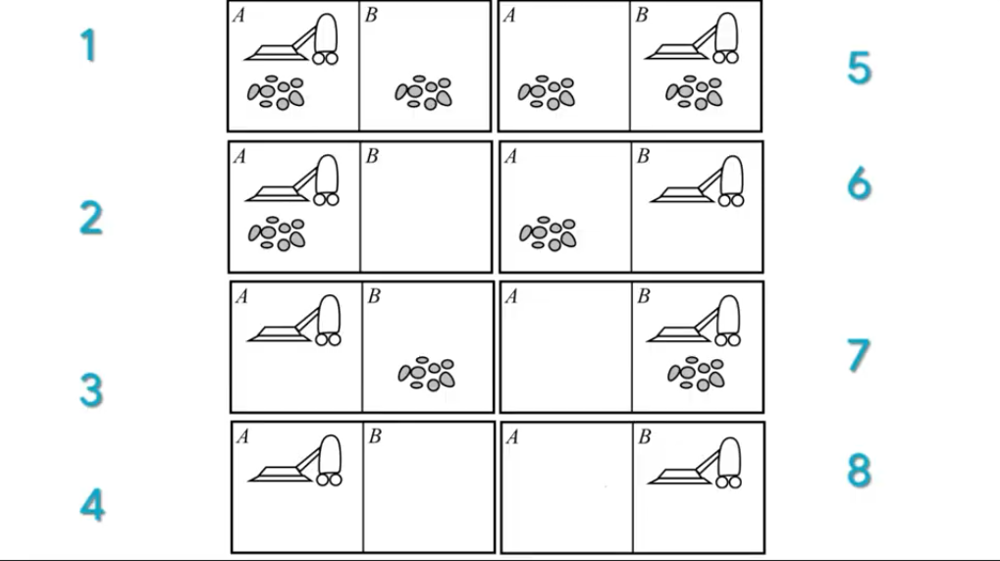

# Tareas del Primer Semestre 2025 IA 

### Tarea 1 (Simple reflex agent)

La tarea consiste en hacer que la aspiradora pueda visitar todos los estados presentados en la siguiente imagen

- [Tarea 1](https://walterjav19.github.io/Tareas_IA1_Magistral/tarea1)
